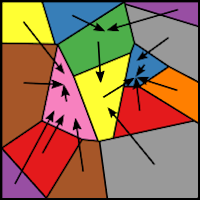
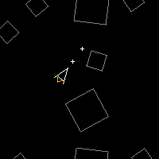

## Hi! I'm Ryan

I am a Computer Scientist and Mathematician with a wide range of technical
interests. In my free time, I enjoy working on mathematical, statistical,
and programming projects as personal hobbies.

Currently, I work as a Senior Quantitative Analyst at Wells Fargo, where I
focus on researching, developing, and monitoring risk models across a broad
range of asset classes.

Feel free to reach out via email with any questions, comments, or ideas. I aim
to respond reasonably quickly!

https://ryanagibson.com

### Some Projects

Feel free to look through my repositories list (many are private), but I've
linked some projects in the images below!

